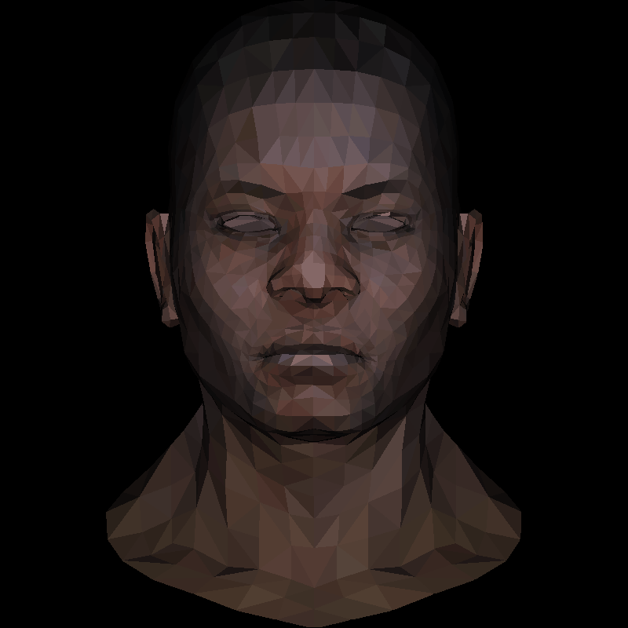

# 3D Head Rotation

Render a 3D human head using simple Python and OpenCV!



## Usage  
```sh
python render.py --roll <angle> --pitch <angle> --yaw <angle>
```

## Arguments  

| Argument  | Description                                | Default |
|-----------|--------------------------------------------|---------|
| `--roll`  | Rotation around **X-axis** (degrees per frame) | `0`     |
| `--pitch` | Rotation around **Y-axis** (degrees per frame) | `0`     |
| `--yaw`   | Rotation around **Z-axis** (degrees per frame) | `0`     |